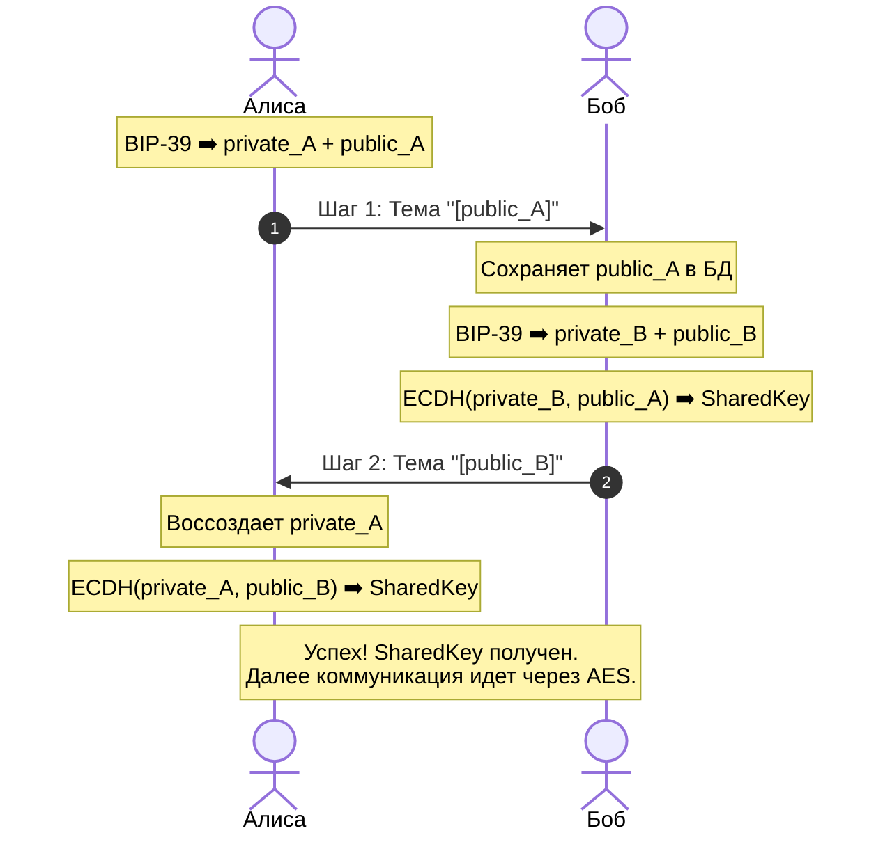

# Mycelium

Общайтесь зашифрованными сообщениями  
через сервера почты, даже где белые списки.    
[mycelium.site](https://your-site.com)

## О проекте

Это приложение как вспомогательный инструмент для связи с близкими в трудную минуту. Это не замена привычным мессенджерам. Программа работает на базе почтового сервера, но 
в целях безопасности, никакие третьи лица не смогут прочитать ваши сообщения.

> [!NOTE]
> В настоящее время Mycelium находится в стадии бета-тестирования, поэтому могут возникнуть непредвиденные проблемы. Пожалуйста, сообщите о них.

## Технологии безопасности
### • [AES (Advanced Encryption Standard)](https://en.wikipedia.org/wiki/Advanced_Encryption_Standard)
Симметричный алгоритм блочного шифрования. AES-128 никогда не был взломан без знания ключа. AES считается «золотым стандартом» шифрования во всем мире.

### • [BIP39 List](https://cryobackup.com/pages/bip39-list)
Стандарт генерации мнемонической фразы (seed-фразы) из определенного набора слов. Он используется в качестве криптографического корня (мастер-ключа) для детерминированного и стабильного создания пар ключей, исключая необходимость хранения приватного ключа в открытом виде.

### • [ECDH (Elliptic Curve Diffie-Hellman)](https://en.wikipedia.org/wiki/Elliptic-curve_Diffie%E2%80%93Hellman)
Криптографический протокол обмена ключами, который позволяет двум сторонам, не имеющим общего секрета заранее, безопасно выработать общий сеансовый ключ через незащищённый канал связи.

## Схема криптографического рукопожатия (ECDH Handshake)

Процесс инициализации защищенного чата между Алисой (Отправитель) и Бобом (Получатель) без участия сервера.

### Диаграмма взаимодействия

## Установка Windows

## Скачать mycelium
- [mycelium for mobile]() [in progress]
- [mycelium for Linux]() [in progress]

## Поддержать автора
Поддержите развитие проекта! Ваше внимание и помощь очень важны для продолжения работы над Mycelium. 

Если вам нравится проект, поделитесь им со своими друзьями и звёздочкой на GitHub. Это помогает нам продолжать улучшать безопасное общение.
 
## Лицензия
Проект **Mycelium** является программным обеспечением с открытым исходным кодом и распространяется под лицензией [GNU GPL v3](LICENSE). 

Это гарантирует, что:
* Код проекта всегда доступен для независимого аудита безопасности.
* Любые модификации или форки этого приложения также обязаны оставаться открытыми и бесплатными.
